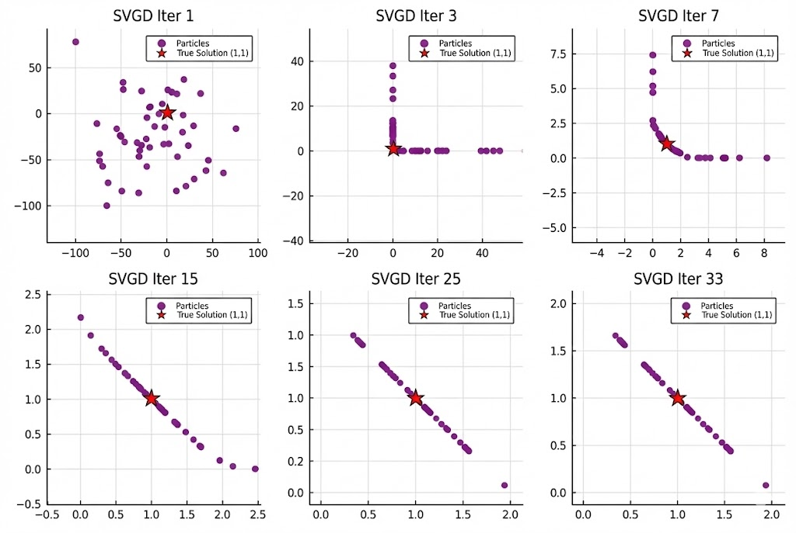

# Constrained Global Optimization through Stein Variational Inference
*MultiModal, NonConvex-NonConnected-NonDifferentiable, Hard Constraints, GPU Acceleration.*

## Overview
The repo serves the frontier tracking and implementation of <b>Optimization As Inference (GOptInfer)</b> at a principle level.

## What is it?
Traditional global optimization algorithms such as <b>particle swarm</b> have low sample efficiency. But <b>Bayesian Optimization</b> based on Bayesian Inference 
gives a perfect theoretical framework of "sampled global optimization", where <b>Variational Inference</b> plays a crucial role in 
reducing the calculation complexity of posterior distribution in Gaussian process regression. 

<b>Stein Variational Inference</b> is general one of variational inference, originated from [1]. Its aim is to update 
a set of distributions $q(x)$ (Particles) to approximate the target distribution $p(x)$ (Objective Function), 
by minimizing Kullback-Leibler (KL) divergence between $q(x)$ and  $p(x)$.

[😢 Feel dizzy ? Relax !!!]

Just remember that <b>objective function is inferred by updating a set of particles following a mysterious direction</b>.

Interestingly, "mysterious direction" has two intuitive components: 
- <b>Driving Force</b>: Drive the particles to move towards the high-probability region (minimization) of the target distribution $p(x)$;
- <b>Repulsive Force</b>: generate a force that causes the particles to move away from each other, in case of collapsing into the same local minimum point.

Therefore, particles will eventually gather around several local minima and then obtain Multimodal Feasible and Locally Optimal solutions. 

[🧐 Wow!...]

## Why is it?
Stein Variational Inference inherently possesses several fundamental advantages as follows:
1. <b>Multimodality</b>: update a set of particles simultaneously to get multiple feasible and optimal solutions;
2. <b>NonConvex</b>: same reason;
3. <b>NonConnected</b>: same reason;
4. <b>NonDifferentiable</b>: Iterative direction can be obtained through sampling rather than differentiation;
5. <b>Parallel Acceleration</b>: potential real-time implementation using GPU;

Many problems in upper-level domains starve for these advantages.
1. Obstacle avoidance: Not just a single trajectory from convex solver or A-star or RRT;
2. <b>Dynamic game</b>: search multiple equilibrium points;
3. Obtain multiple possible solutions for the estimation problem or the scheme design;
4. ...

## What else?
👉 <b>Hard Constraints</b>.

Besides real-time, SVGD must be able to handle hard constraints from practical problems.

## How it works?
see next.

## An Implementation of Constrained Stein Variational Inference
A simple convex example:

The optimal solution is clearly x₁=1, x₂=1, and cost=2.

The convergence process is shown below,
- <b>Sprinkle "salt" >>
- Update the set >>
- Reduce KL divergence  and constraints' residual >>
- Converge to one/several local minima.</b>

And the mean is accurate at the sole global minimum (1,1), and maintains a mutually exclusive distribution (STD==0.5) on the constrained line.

## Reference
[1] Liu, Q., & Wang, D. (2016). Stein variational gradient descent: A general purpose bayesian inference algorithm. Advances in neural information processing systems, 29.

[2] Power, T., & Berenson, D. (2024). Constrained stein variational trajectory optimization. IEEE Transactions on Robotics.
